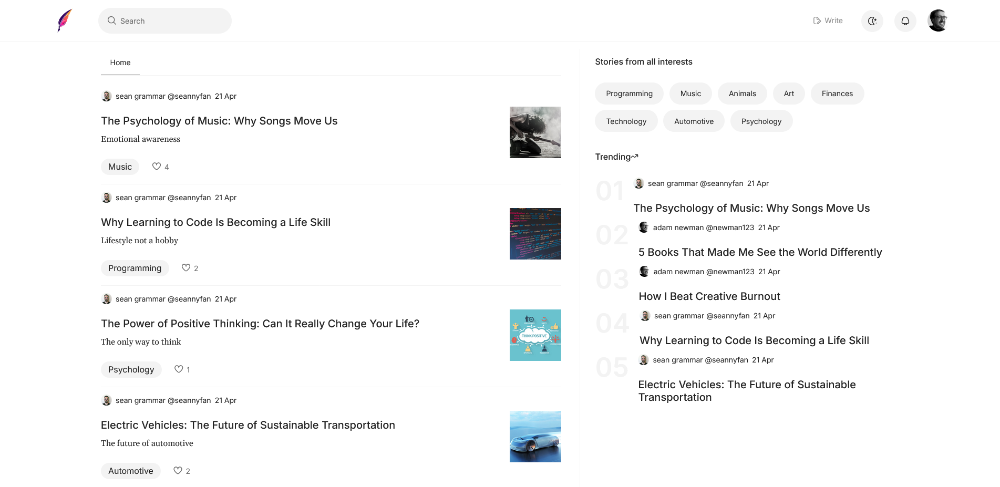

    

 

<a href="https://pownprojects.site/inkspire" style="text-decoration: underline; font-weight: bold;">Inkspire</a>
is a modern, MERN stack blogging platform that empowers users to express themselves through rich content. Built with a seamless user experience in mind, Inkspire allows users to write, comment, like articles, respond to comments, and manage their profiles with ease.

## 🚀 Features

- ✍️ Create and publish rich blog posts with **Editor.js**
- 💬 Comment on posts and respond to other users
- ❤️ Like articles and engage with the community
- 👤 User authentication and profile management
- 🛠️ Update and customize user profiles

## 🛠️ Technologies Used

### Frontend

- **React** – Component-based UI
- **Editor.js** – Rich text editing for blogs
- **React Router DOM** – Client-side routing
- **Tailwind CSS** – Utility-first CSS framework for fast styling

### Backend

- **Express** – Node.js web application framework
- **Mongoose** – MongoDB object modeling for Node.js
- **Firebase Authentication** – Secure and easy user authentication
- **JWT (JSON Web Tokens)** – For secure user session handling

## 📸 Screenshots

    

    

